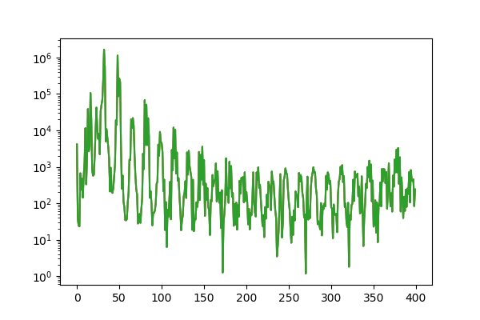

# Getting Started

An MPI data file consists of a collection of parameters that can be
divided into metadata and measurement data. Let us now consider that
the string `filename` contains the path to an MPI file (e.g. an MDF file).
Then be can open the file by calling
```julia
julia> f = MPIFile(filename)
```
`f` can be considered to be a handle to the file. The file will be automatically
be closed when `f` is garbage collected. The philosophy of MPIFiles.jl is that
the content of the file is only loaded on demand. Hence, opening an MPI file
is a cheap operations. This design allows it, to handle system matrices, which
are larger than the main memory of the computer.

Using the file handle it is possible now to read out different metadata. For instance
we can determine the number of frames measured:
```julia
julia> acqNumFrames(f)
500
```
Or we can access the drive field strength
```julia
julia> dfStrength(f)
1×3×1 Array{Float64,3}:
[:, :, 1] =
 0.014  0.014  0.0
```
Now let us load some measurement data. This can be done by calling
```julia
u = getMeasurementsFD(f, frames=1:100, numAverages=100)
```
Then we can display the data using the PyPlot package
```julia
using PyPlot
figure(6, figsize=(6,4))
semilogy(abs.(u[1:400,1,1,1]))
```


This shows a typical spectrum for a 2D Lissajous sampling pattern. The
`getMeasurementsFD` is a high level interface for loading MPI data, which has
several parameters that allow to customize the loading process. Details on
loading measurement data are outlined in [Measurements](@ref).

In the following we will first discuss the low level interface.
